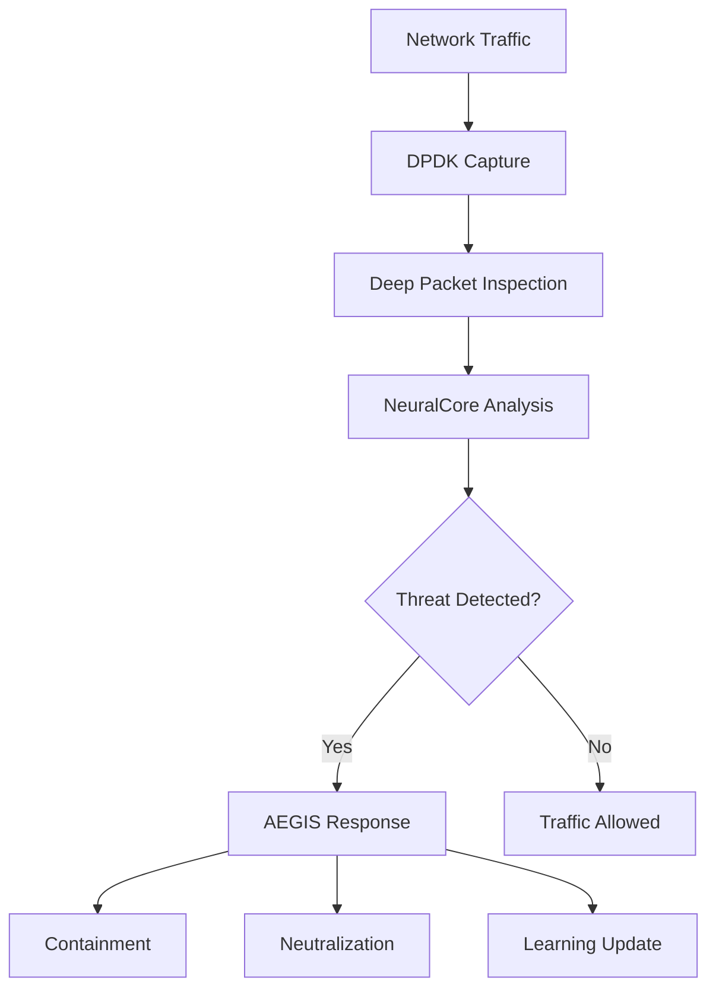

# ICARUS Technical Architecture

## System Overview

ICARUS employs a revolutionary multi-layer defense architecture that fundamentally reimagines network security.

## Core Design Principles

### 1. **Zero-Trust by Design**
- No implicit trust, even for internal communications
- Continuous verification at every layer
- Cryptographic proof of identity for all components

### 2. **Autonomous Intelligence**
- Self-learning threat patterns
- Predictive defense mechanisms
- No human intervention required for 99.9% of threats

### 3. **Quantum-Safe Architecture**
- All cryptographic operations use post-quantum algorithms
- Hybrid classical-quantum approach for compatibility
- Future-proof against quantum computing threats

## Component Architecture

### NeuralCore Engine
```
┌─────────────────────────────────────────┐
│          NeuralCore Engine              │
├─────────────────────────────────────────┤
│  Transformer-based Threat Detection     │
│  ├── Multi-head Attention (8192 dim)    │
│  ├── Temporal Pattern Analysis          │
│  └── Behavioral Anomaly Detection      │
├─────────────────────────────────────────┤
│  Real-time Inference (<1ms)             │
│  Hardware Acceleration (CUDA/TPU)       │
└─────────────────────────────────────────┘
```

### AEGIS Orchestrator
- **Service Mesh**: Istio-based with custom security policies
- **Container Runtime**: gVisor for enhanced isolation
- **Orchestration**: Kubernetes with custom CRDs

### Data Flow Architecture


## Security Layers

### Layer 1: Physical Security
- Hardware Security Modules (HSM)
- Trusted Platform Module (TPM 2.0)
- Secure boot chain

### Layer 2: Network Security
- Custom encrypted protocols
- Dynamic port hopping
- GhostMesh topology hiding

### Layer 3: Application Security
- Runtime Application Self-Protection (RASP)
- Code obfuscation and anti-tampering
- Secure enclaves (SGX/SEV)

### Layer 4: Data Security
- End-to-end quantum-safe encryption
- Homomorphic encryption for processing
- Secure multi-party computation

## Scalability Architecture

### Horizontal Scaling
- Microservices architecture
- Event-driven design
- Stateless components

### Vertical Scaling
- GPU/TPU acceleration
- FPGA offloading
- Custom ASIC development (Phase 4)

## Innovation Highlights

### 1. **Temporal Threat Analysis**
Analyzes attacks across time dimensions, detecting slow-burn APTs that traditional systems miss.

### 2. **Swarm Intelligence**
Multiple ICARUS instances form a collective intelligence, sharing threat data in real-time.

### 3. **Adaptive Cryptography**
Dynamically adjusts encryption strength based on threat level and performance requirements.

### 4. **Neural Deception Networks**
AI-generated honeypots that evolve to match attacker behavior patterns.

## Performance Specifications

| Component | Metric | Target |
|-----------|---------|--------|
| Packet Processing | Throughput | 100 Gbps |
| Threat Detection | Latency | <1ms |
| Encryption | Overhead | <5% |
| Memory Usage | Per Connection | <1KB |
| CPU Usage | Idle State | <1% |